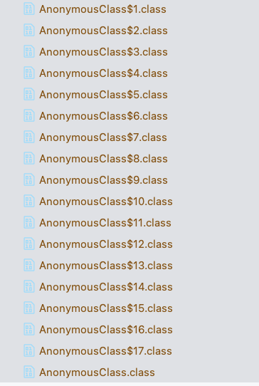
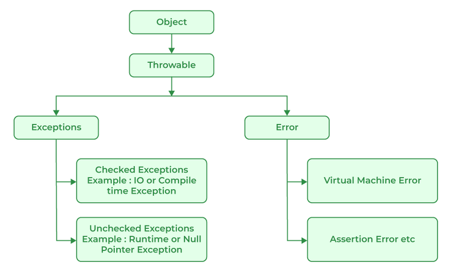

# Access Modifiers and Lambda Expressions

# Access Modifiers

Java access modifiers determine the scope of access for classes, constructors, variables, and methods. There are four types of access modifiers in Java:

1. **Default:** When no access modifier is specified, it is set to default. It is accessible only within the same package.
2. **Private:** The access level of a private modifier is only within the class. It cannot be accessed from outside the class.
3. **Protected:** The protected access modifier is accessible within the same package and subclasses.
4. **Public:** The public access modifier is accessible from any other class.

Here's a table summarizing the access levels for each modifier:

| Modifier | Class | Package | Subclass | World |
| --- | --- | --- | --- | --- |
| Public | Yes | Yes | Yes | Yes |
| Protected | Yes | Yes | Yes | No |
| Default | Yes | Yes | No | No |
| Private | Yes | No | No | No |

**Explanation:**

- **Class:** The class in which the member is declared.
- **Package:** Other classes within the same package.
- **Subclass:** Classes that inherit from the class where the member is declared.
- **World:** All other classes.

**Key Points:**

- **Public:** Members are accessible from any other class.
- **Protected:** Members are accessible within the same package and by subclasses. Protected access gives subclass a chance to use the helper method or variable of the superclass.
- **Default (no modifier):** If you do not specify any access level, the default access level is used. Default members are accessible within the same package.
- **Private:** The most restrictive access level. The methods and variables declared private can only be accessed within the declared class itself.

# Lambda Expressions

## Introduction:

It’s an anonymous function, Let us understand the lambda expressions with an example

```java
public class AnonymousClass {

    public static void main(String[] args) {
        Thread thread = new Thread(new Runnable() {
            @Override
            public void run() {
                System.out.println("In another thread");
            }
        });

        thread.start();
    }
}
```

In this code we are creating an new thread by using anonymous inner class. When you create a new with interface type, it creates an anonymous inner class. This code creates too much of ceremony and now let’s understand how we can remove this ceremony.

In general any function has four things

- Name
- Parameters List
- Body
- Return type

If you think about a function, the most important part is body and parameter list. The name and return type don’t have too much value when a function can be anonymous and the return type can be inferred as well by the compiler. With is understanding, we can say the lambda expressions typically contains only **parameter list and body**.

```java
public class LambdaExpression {

    public static void main(String[] args) {
        Thread thread = new Thread(() -> System.out.println("In another thread"));
        thread.start();
        System.out.println("In Main");
    }
}
```

### Syntax of a Lambda Expression

The basic syntax of a lambda expression is:

```java
(parameters) -> expression

```

or

```java
(parameters) -> { statements; }

```

- **Parameters**: This could be one or more input parameters for the lambda expression. If there are no parameters, you use empty parentheses `()`.
- **Arrow Token (`>`)**: This separates the parameters from the body of the expression.
- **Body**: This contains the code that defines what the lambda expression should do. It can be a single expression or a block of code.

## Under the Hood:

With the lambda expression we have avoided the ceremony but how does this work ? Is the compiler converting lambda expression to an anonymous function ? Let us understand about this.

Let us assume that the compiler converts the lambda expression to anonymous inner class. Let’s consider this code

```java
public class AnonymousClass {

    public static void main(String[] args) {
        Thread th;
        th = new Thread(new Runnable() {
            @Override
            public void run() {
                System.out.println("In another thread");
            }
        });
        th = new Thread(new Runnable() {
            @Override
            public void run() {
                System.out.println("In another thread");
            }
        });
        th = new Thread(new Runnable() {
            @Override
            public void run() {
                System.out.println("In another thread");
            }
        });
        th = new Thread(new Runnable() {
            @Override
            public void run() {
                System.out.println("In another thread");
            }
        });
        th = new Thread(new Runnable() {
            @Override
            public void run() {
                System.out.println("In another thread");
            }
        });
        th = new Thread(new Runnable() {
            @Override
            public void run() {
                System.out.println("In another thread");
            }
        });
        th = new Thread(new Runnable() {
            @Override
            public void run() {
                System.out.println("In another thread");
            }
        });
        th = new Thread(new Runnable() {
            @Override
            public void run() {
                System.out.println("In another thread");
            }
        });
        th = new Thread(new Runnable() {
            @Override
            public void run() {
                System.out.println("In another thread");
            }
        });
        th = new Thread(new Runnable() {
            @Override
            public void run() {
                System.out.println("In another thread");
            }
        });
        th = new Thread(new Runnable() {
            @Override
            public void run() {
                System.out.println("In another thread");
            }
        });
        th = new Thread(new Runnable() {
            @Override
            public void run() {
                System.out.println("In another thread");
            }
        });
        th = new Thread(new Runnable() {
            @Override
            public void run() {
                System.out.println("In another thread");
            }
        });
        th = new Thread(new Runnable() {
            @Override
            public void run() {
                System.out.println("In another thread");
            }
        });
        th = new Thread(new Runnable() {
            @Override
            public void run() {
                System.out.println("In another thread");
            }
        });
        th = new Thread(new Runnable() {
            @Override
            public void run() {
                System.out.println("In another thread");
            }
        });
        th = new Thread(new Runnable() {
            @Override
            public void run() {
                System.out.println("In another thread");
            }
        });

        th.start();
    }
}
```

If we compile this code, this will generate 17 anonymous inner classes as shown below, this is a bloating of a lot of anonymous inner classes.



This will create a following problems

- The more anonymous inner classes you create, more classes on the disk and it’s not going to be fun.
- Loading the Jar files with too many classes will take more time and this will create a more memory footprint.
- This leads to more garbage collection

### InvokeDynamic:

It enables the JVM to invoke methods dynamically, without the need for static type information at compile time.When the Java compiler encounters a lambda expression, it generates bytecode that includes an `invokedynamic` instruction. This instruction specifies the bootstrap method and the static arguments required to link the lambda expression.

By using `invokedynamic`, the Java compiler avoids generating a separate class file for each lambda expression. Instead, it generates a compact bytecode representation that defers the actual implementation until runtime. This approach reduces the number of generated classes and allows the JVM to optimize the lambda expressions based on their usage patterns.

```java
public class LambdaExpressions {
    public static void main(String[] args) {
        Thread thread;
        thread = new Thread(() -> System.out.println("In another thread"));
        thread = new Thread(() -> System.out.println("In another thread"));
        thread = new Thread(() -> System.out.println("In another thread"));
        thread = new Thread(() -> System.out.println("In another thread"));
        thread = new Thread(() -> System.out.println("In another thread"));
        thread = new Thread(() -> System.out.println("In another thread"));
        thread = new Thread(() -> System.out.println("In another thread"));
        thread = new Thread(() -> System.out.println("In another thread"));
        thread = new Thread(() -> System.out.println("In another thread"));
        thread = new Thread(() -> System.out.println("In another thread"));
        thread = new Thread(() -> System.out.println("In another thread"));
        thread = new Thread(() -> System.out.println("In another thread"));
        thread = new Thread(() -> System.out.println("In another thread"));
        thread = new Thread(() -> System.out.println("In another thread"));
        thread = new Thread(() -> System.out.println("In another thread"));
        thread = new Thread(() -> System.out.println("In another thread"));
        thread = new Thread(() -> System.out.println("In another thread"));

        thread.start();
        System.out.println("In Main");
    }
}
```

All the lambda expression code will be converted to `invokedynamic` in the bytecode. Also when you compile it there is only one class file no more bloated class files as we saw in the anonymous class.


## Transforming Iterations:

Now with our understanding with lambda’s let us dig deeper on how it’s going to help us. Let’s use the following example: **We have a list of integer and we want to print it**.

We can use external iterator to implement the above problem. It’s where you control the iteration all by yourself. You decide on how and when to do it and you have the complete control of the iteration.

```java
public class ExternalIterator {
    public static void main(String[] args) {
        List<Integer> numbers = Arrays.asList(0, 1, 2, 3, 4, 5, 6, 7, 8, 9, 10);

        // External Iterator
        for (int i = 0; i < numbers.size(); i++){
            System.out.println(numbers.get(i));
        }
        System.out.println();

        // External Iterator
        for (int i : numbers){
            System.out.println(i);
        }
    }
}
```

Instead of using external iterators we can also use an internal iterator to solve the above problem. We can use the internal iterator using `numbers.forEach()` here we are calling forEach on numbers, rather than passing the collection to for loop we are invoking the forEach on the collection.

What is the benefit of it ?

- When you pass an object to a function versus you call an function on a object itself, When you call a function on a object you readily benefit from a polymorphism.

```java
import java.util.Arrays;
import java.util.List;
import java.util.function.Consumer;

public class InternalIterator {
    public static void main(String[] args) {
        List<Integer> numbers = Arrays.asList(0, 1, 2, 3, 4, 5, 6, 7, 8, 9, 10);
        numbers.forEach(new Consumer<Integer>() {
            @Override
            public void accept(Integer integer) {
                System.out.println(integer);
            }
        });
    }
}
```

Here we brought a consumer and we are ask it to iterate and then pass the value to this consumer over and over. Here we used internal iterator instead of external iterator and the above code can be converted code to lambda expression.

```java
import java.util.Arrays;
import java.util.List;

public class InternalIterator {
    public static void main(String[] args) {
        List<Integer> numbers = Arrays.asList(0, 1, 2, 3, 4, 5, 6, 7, 8, 9, 10);
        numbers.forEach((Integer value) -> System.out.println(value));

        // This can be further trimmed to following code because we already
        // defined the type numbers as Integer no need to explicitly specify it
        // Also `(Integer value)` parentheses is optional but only for one parameter lambda
        numbers.forEach(value -> System.out.println(value));
    }
}
```

## Design Pattern

Let’s understand how lambda expressions can complement the design patterns. Let’s start with a an example: You have a list of numbers `[1, 2, 3, 4, 5, 6, 7, 8, 9, 10]` and you want to calculate the sum of all the list

```java
import java.util.List;

public class TotalValues {
    public static int totalSum(List<Integer> integerList){
        int sum = 0;
        for (int number : integerList){
            sum += number;
        }
        return sum;
    }

    public static void main(String[] args) {
        List<Integer> numbers = List.of(1, 2, 3, 4, 5, 6, 7, 8, 9, 10);
        System.out.println(totalSum(numbers));
    }
}
```

The product folks come at the last moment and say they need one more feature: they want a sum of even numbers as well. Okay, we can do this by creating another function totalSumEven.

```java
static int totalSumEven(List<Integer> integerList){
        int evenSum = 0;
        for (int number : integerList){
            if (number % 2 == 0){
                evenSum += number;
            }
        }
        return evenSum;
    }
```

It looks like the product missed one of the requirements as well. They also want a sum of odd numbers from the list. Now you look at the code it looks like there is going to be a lot of boilerplate even though we define it as separate functions.

```java
static int totalSumOdd(List<Integer> integerList){
        int oddSum = 0;
        for (int number : integerList){
            if (number % 2 != 0){
                oddSum+= number;
            }
        }
        return oddSum;
    }
```

How can we avoid this duplicate boilerplate code ? we can overcome this problem using lambda expression by passing function as an argument(i.e. High Order Function)

```java
import java.util.List;
import java.util.function.Predicate;
public class StrategyPattern {
    static int totalSum(List<Integer> numbers, Predicate<Integer> selector){
        int sum = 0;
        for (int number : numbers){
            if (selector.test(number)){
                sum += number;
            }
        }
        return sum;
    }
    public static void main(String[] args) {
        List<Integer> numbers = List.of(1, 2, 3, 4, 5, 6, 7, 8, 9, 10);
        System.out.println(totalSum(numbers, e -> true));
        System.out.println(totalSum(numbers, e -> e / 2 == 0));
        System.out.println(totalSum(numbers, e -> e / 2 != 0));
    }
}
```

So what we implemented is a strategy pattern when the behaviour of the function is changed dynamically based on the parameter which the caller is passing. With lambda expressions and functional interfaces you don’t have to invest your time and effort in creating interfaces and classes for strategy patterns anymore.

## Functional Interface

A functional interface in Java is an interface that contains exactly one abstract method. These interfaces are used as the basis for lambda expressions in Java 8 and beyond. Despite having only one abstract method, functional interfaces can have multiple default or static methods. Java provides the `@FunctionalInterface` annotation, which is not mandatory but helps in checking at compile time that an interface meets the requirements of being functional.

Functional interfaces are key to Java's lambda expressions, enabling a more concise and readable code, especially when working with APIs that require passing behavior as parameters, such as event listeners, or when working with the Java Stream API for bulk data operations.

### Define a Functional Interface

Let's say we have a functional interface `GreetingService` that has one abstract method `greet`:

```java
@FunctionalInterface
interface GreetingService {
    void greet(String message);
}
```

### Custom Lambda Expressions With Functional Interface

With lambda expressions, you can simplify the above code:

```java
GreetingService service = message -> System.out.println("Hello " + message);
service.greet("World");
```

### Another Example

To write your own lambda expression, you need to define a functional interface first. Let's create a simple one that performs a calculation on two integers:

```java
@FunctionalInterface
interface MathOperation {
    int operation(int a, int b);
}

```

Now, you can use this interface to create lambda expressions for different mathematical operations:

```java
MathOperation add = (a, b) -> a + b;
MathOperation subtract = (a, b) -> a - b;

System.out.println("10 + 5 = " + add.operation(10, 5));
System.out.println("10 - 5 = " + subtract.operation(10, 5));

```

### Java's Built-in Functional Interfaces

Java provides a set of functional interfaces in the `java.util.function` package that you can use with lambda expressions. Some of the most commonly used ones are:

- **Predicate<T>**: Represents a predicate (boolean-valued function) of one argument.
   - Abstract method: **`boolean test(T t)`**
   - It represents a predicate/condition, a boolean-valued function that checks a condition on an input.
   - It is used for filtering or testing elements based on a condition.

```java
import java.util.function.Predicate;

public class PredicateExample {
    public static void main(String[] args) {
        Predicate<Integer> isPositive = x -> x > 0;
        System.out.println(isPositive.test(10)); // true
        System.out.println(isPositive.test(-10)); // false
    }
}

```

- **Consumer<T>**: Represents an operation that accepts a single input argument and returns no result.
   - Abstract method: **`void accept(T t)`**
   - This represents an operation that accepts a single input and returns no value or result.
   - It is used for performing actions on input values, such as printing, saving, or processing.

```java
import java.util.function.Consumer;

public class ConsumerExample {
    public static void main(String[] args) {
        Consumer<String> print = x -> System.out.println(x);
        print.accept("Hello, World!"); // prints "Hello, World!"
    }
}

```

- **Function<T,R>**: Represents a function that accepts one argument and produces a result.
   - Abstract method: **`R apply(T t)`**
   - This represents a function that accepts one argument and produces a result.
   - It is commonly used for mapping or transforming input to output.

```java
import java.util.function.Function;

public class FunctionExample {
    public static void main(String[] args) {
        Function<Integer, String> convert = x -> "Number: " + x;
        System.out.println(convert.apply(5)); // "Number: 5"
    }
}

```

- **Supplier<T>**: Represents a supplier of results.
   - Abstract method: **`T get()`**
   - This represents a supplier of results, providing a value without taking any input.
   - It is commonly used for lazy initialization or generating values.

```java
import java.util.function.Supplier;

public class SupplierExample {
    public static void main(String[] args) {
        Supplier<String> getString = () -> "Hello from Supplier!";
        System.out.println(getString.get()); // "Hello from Supplier!"
    }
}

```

- **BiFunction<T,U,R>**: Represents a function that accepts two arguments and produces a result.
   - Abstract method: **`R apply(T t, U u),`** represents a function that takes two arguments of types `T` and `U` and returns a result of type `R`.
   - It is commonly used when you need to perform an operation on two input values and produce a result based on those values.

```java
BiFunction<Integer, Integer, Integer> sum = (a, b) -> a + b;
int result = sum.apply(5, 3);
System.out.println(result); // Output: 8

```

### When to Use Functional Interfaces

Functional interfaces are particularly useful when you want to:

- Implement an interface with only one abstract method in a place where an instance of an interface is expected.
- Use APIs that are designed to work with lambda expressions, such as the Stream API, `java.util.function` package, or `java.util.concurrent` package classes.
- Make your code more readable and concise by eliminating the boilerplate code required for anonymous class implementations.
- Support higher-order functions, allowing functions to be passed as arguments, returned as values, or stored in data structures.

### Relationship Between Functional Interfaces and Lambda Expressions

The relationship between functional interfaces and lambda expressions is foundational to understanding Java's approach to functional programming:

- **Enablement**: Functional interfaces provide the target type for lambda expressions. A lambda expression can be assigned to a functional interface type if the lambda expression's parameter list matches the interface's abstract method signature.
- **Syntactic Sugar**: Lambda expressions are essentially a more concise and readable way to create instances of functional interfaces without the boilerplate code of anonymous classes.
- **Interoperability**: This relationship allows lambda expressions to be used wherever functional interfaces are expected, making it easier to use existing APIs like collections, streams, or new APIs designed with functional programming in mind.

In summary, functional interfaces and lambda expressions work together to bring functional programming concepts into Java, allowing developers to write more expressive, flexible, and concise code.

# Exceptions:

Java exceptions are events that disrupt the normal flow of a program's instructions. They are objects that wrap an error event that occurred within a method and indicate that something went wrong. Handling exceptions allows you to manage errors gracefully and maintain the flow of your application. In Java, exceptions are part of `java.lang` package.

### Types of Exceptions in Java:

**Checked Exceptions**: These are exceptions that are checked at compile time. If some code within a method throws a checked exception, then the method must either handle the exception or it must specify the exception using `throws` keyword.

**Unchecked Exceptions**: These are exceptions that are not checked at compile time. They are also known as runtime exceptions. These include programming bugs, such as logic errors or improper use of an API. Runtime exceptions are ignored at the time of compilation.

**Errors**: These are not exceptions at all, but problems that arise beyond the control of the user or the programmer. Errors are typically ignored in your code because you can rarely do anything about an error. For example, system crashes, OutOfMemoryError.

### Hierarchy of Java Exception classes:

The Throwable class is the superclass of all errors and exceptions in the Java language. The hierarchy is as follows:

- **Throwable**
   - **Error**
   - **Exception**
      - **RuntimeException**



### Exception Handling Keywords:

- **try**: The try block contains a set of statements where an exception can occur. It must be followed by either catch or finally block or both.
- **catch**: The catch block is used to handle the exception. It must be preceded by a try block or another catch block.
- **finally**: The finally block is used to execute a set of statements, following a try block or catch block, that must be executed whether an exception is handled or not.
- **throw**: The throw keyword is used to explicitly throw an exception from a method or any block of code.
- **throws**: The throws keyword is used in the method signature to declare the exceptions that a method might throw, but does not handle itself.

### Basic Example of Exception Handling

```java
public class Main {
    public static void main(String[] args) {
        try {
            int divideByZero = 5 / 0;
        } catch (ArithmeticException e) {
            System.out.println("ArithmeticException => " + e.getMessage());
        } finally {
            System.out.println("This is the finally block.");
        }
    }
}

```

In this example:

- The `try` block contains code that might throw an exception.
- The `catch` block handles the specific exception. In this case, it's an `ArithmeticException`.
- The `finally` block executes regardless of whether the exception was handled or not.

### Checked Exception

Checked exceptions are exceptions that need to be declared in a method's `throws` clause if they can be thrown by the execution of the method but are not caught within the method. One common example of a checked exception is `IOException`, which occurs when an input/output operation fails or is interrupted.

```java
import java.io.*;

public class CheckedExceptions {
    private static void readFile(String path) throws IOException {
        try {
            var inputStream = CheckedExceptions.class.getResourceAsStream(path);
            if (inputStream == null){
                throw new FileNotFoundException("Resource not found: " + path);
            }
            String line;
            BufferedReader reader = new BufferedReader(new InputStreamReader(inputStream));
            while ((line = reader.readLine()) != null) {
                System.out.println(line);
            }
            reader.close();
        } catch (IOException e) {
            System.out.println("An error occurred while trying to read the file: " + e.getMessage());
            throw e;
        }
    }

    public static void main(String[] args) {
        var path = "/input.txt";
        try {
            readFile(path);
        } catch (IOException e) {
            System.err.println("Error while reading a file = "+e);
        }
    }
}

```

In this example, `FileReader` constructor can throw a `FileNotFoundException` (a subclass of `IOException`), and `readLine()` can throw an `IOException`. Both are checked exceptions, so they must be either caught or declared to be thrown.

### Unchecked Exception Example

Unchecked exceptions are runtime exceptions. They do not need to be declared in a method's `throws` clause. They include programming bugs, such as logic errors or improper use of an API. An example of an unchecked exception is `ArithmeticException`.

```java
public class UncheckedExceptionExample {
    public static void main(String[] args) {
        try {
            int result = 10 / 0;
        } catch (ArithmeticException e) {
            System.out.println("An arithmetic exception occurred: " + e.getMessage());
        }
    }
}

```

In this example, dividing by zero causes an `ArithmeticException` to be thrown, which is an unchecked exception. The program catches the exception, so it doesn't crash and instead prints a message explaining what went wrong.

These examples demonstrate how to handle checked and unchecked exceptions in Java. Handling exceptions properly is crucial for creating reliable and robust applications.

### TryWithAutoResource:
Try-with-resources, also known as automatic resource management, is a feature introduced in Java 7 that simplifies the handling of resources that need to be closed, such as database connections, input/output streams, or sockets. It ensures that the resources are automatically closed after they are no longer needed, even if an exception occurs.

```java
import java.io.StringReader;

public class TryWithAutoResource {
  public static void main(String[] args) {
    String data = "Hello, World!";

    try (StringReader reader = new StringReader(data)) {
      int character;
      while ((character = reader.read()) != -1) {
        System.out.print((char) character);
      }
    } catch (Exception e) {
      e.printStackTrace();
    }
  }
}
```

### Best Practices

1. Handle exceptions as specifically as possible, catching the most specific exception first.
2. Avoid catching generic Exception or Throwable, as it can make your code less readable and might catch unexpected exceptions.
3. Use finally blocks for cleanup code or use try-with-resources for auto-closable resources.
4. Do not use exceptions for flow control in your program.
5. Document the exceptions your method can throw using the `@throws` Javadoc tag.