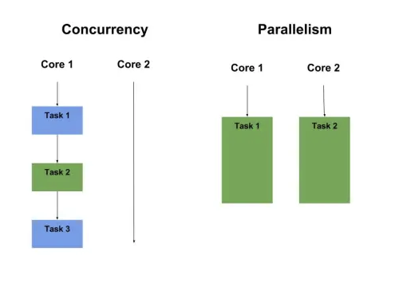

# Java Tutorial - Session 5 - Exception and Threads

# Exceptions:

Java exceptions are events that disrupt the normal flow of a program's instructions. They are objects that wrap an error event that occurred within a method and indicate that something went wrong. Handling exceptions allows you to manage errors gracefully and maintain the flow of your application. In Java, exceptions are part of `java.lang` package.

### Types of Exceptions in Java:

**Checked Exceptions**: These are exceptions that are checked at compile time. If some code within a method throws a checked exception, then the method must either handle the exception or it must specify the exception using `throws` keyword.

**Unchecked Exceptions**: These are exceptions that are not checked at compile time. They are also known as runtime exceptions. These include programming bugs, such as logic errors or improper use of an API. Runtime exceptions are ignored at the time of compilation.

**Errors**: These are not exceptions at all, but problems that arise beyond the control of the user or the programmer. Errors are typically ignored in your code because you can rarely do anything about an error. For example, system crashes, OutOfMemoryError.

### Hierarchy of Java Exception classes:

The Throwable class is the superclass of all errors and exceptions in the Java language. The hierarchy is as follows:

- **Throwable**
    - **Error**
    - **Exception**
        - **RuntimeException**


### Exception Handling Keywords:

- **try**: The try block contains a set of statements where an exception can occur. It must be followed by either catch or finally block or both.
- **catch**: The catch block is used to handle the exception. It must be preceded by a try block or another catch block.
- **finally**: The finally block is used to execute a set of statements, following a try block or catch block, that must be executed whether an exception is handled or not.
- **throw**: The throw keyword is used to explicitly throw an exception from a method or any block of code.
- **throws**: The throws keyword is used in the method signature to declare the exceptions that a method might throw, but does not handle itself.

### Basic Example of Exception Handling

```java
public class Main {
    public static void main(String[] args) {
        try {
            int divideByZero = 5 / 0;
        } catch (ArithmeticException e) {
            System.out.println("ArithmeticException => " + e.getMessage());
        } finally {
            System.out.println("This is the finally block.");
        }
    }
}

```

In this example:

- The `try` block contains code that might throw an exception.
- The `catch` block handles the specific exception. In this case, it's an `ArithmeticException`.
- The `finally` block executes regardless of whether the exception was handled or not.

### Checked Exception

Checked exceptions are exceptions that need to be declared in a method's `throws` clause if they can be thrown by the execution of the method but are not caught within the method. One common example of a checked exception is `IOException`, which occurs when an input/output operation fails or is interrupted.

```java
import java.io.*;

public class CheckedExceptions {
    private static void readFile(String path) throws IOException {
        try {
            var inputStream = CheckedExceptions.class.getResourceAsStream(path);
            if (inputStream == null){
                throw new FileNotFoundException("Resource not found: " + path);
            }
            String line;
            BufferedReader reader = new BufferedReader(new InputStreamReader(inputStream));
            while ((line = reader.readLine()) != null) {
                System.out.println(line);
            }
            reader.close();
        } catch (IOException e) {
            System.out.println("An error occurred while trying to read the file: " + e.getMessage());
            throw e;
        }
    }

    public static void main(String[] args) {
        var path = "/input.txt";
        try {
            readFile(path);
        } catch (IOException e) {
            System.err.println("Error while reading a file = "+e);
        }
    }
}

```

In this example, `FileReader` constructor can throw a `FileNotFoundException` (a subclass of `IOException`), and `readLine()` can throw an `IOException`. Both are checked exceptions, so they must be either caught or declared to be thrown.

### Unchecked Exception Example

Unchecked exceptions are runtime exceptions. They do not need to be declared in a method's `throws` clause. They include programming bugs, such as logic errors or improper use of an API. An example of an unchecked exception is `ArithmeticException`.

```java
public class UncheckedExceptionExample {
    public static void main(String[] args) {
        try {
            int result = 10 / 0;
        } catch (ArithmeticException e) {
            System.out.println("An arithmetic exception occurred: " + e.getMessage());
        }
    }
}

```

In this example, dividing by zero causes an `ArithmeticException` to be thrown, which is an unchecked exception. The program catches the exception, so it doesn't crash and instead prints a message explaining what went wrong.

These examples demonstrate how to handle checked and unchecked exceptions in Java. Handling exceptions properly is crucial for creating reliable and robust applications.

### TryWithAutoResource:
Try-with-resources, also known as automatic resource management, is a feature introduced in Java 7 that simplifies the handling of resources that need to be closed, such as database connections, input/output streams, or sockets. It ensures that the resources are automatically closed after they are no longer needed, even if an exception occurs.

```java
import java.io.StringReader;

public class TryWithAutoResource {
  public static void main(String[] args) {
    String data = "Hello, World!";

    try (StringReader reader = new StringReader(data)) {
      int character;
      while ((character = reader.read()) != -1) {
        System.out.print((char) character);
      }
    } catch (Exception e) {
      e.printStackTrace();
    }
  }
}
```

### Best Practices

1. Handle exceptions as specifically as possible, catching the most specific exception first.
2. Avoid catching generic Exception or Throwable, as it can make your code less readable and might catch unexpected exceptions.
3. Use finally blocks for cleanup code or use try-with-resources for auto-closable resources.
4. Do not use exceptions for flow control in your program.
5. Document the exceptions your method can throw using the `@throws` Javadoc tag.

# Threads:

In Java, a thread is a lightweight unit of execution within a program. It represents a separate path of execution that can 
run concurrently with other threads within the same program. Threads allow for concurrent programming, enabling multiple tasks 
to be performed simultaneously.

- A thread is a separate path of execution, It has his own stack typically with in the range of 1MB.
- Threads enable concurrent execution, allowing different parts of a program to run simultaneously and independently. Each thread has its own call stack and can execute a separate sequence of instructions.

## Difference between Concurrency and Parallelism

Concurrency and parallelism are related concepts in computer science, often used in the context of multitasking and the execution of multiple tasks or processes. Despite their similarities, they refer to different ways in which tasks are handled and executed by computing systems. Here's a breakdown of the differences:

### Concurrency:
- **Concept**: Concurrency is about dealing with multiple tasks at once. It involves the execution of multiple tasks or processes in overlapping time periods, but not necessarily simultaneously. In a concurrent system, a single CPU can switch between tasks to give the appearance that tasks are running simultaneously by managing their state and execution over time.
- **Use Case**: It's particularly useful in scenarios where tasks need to wait for some events to occur (like I/O operations) or in GUI applications where user interactions need to be responsive while other background tasks continue.
- **Execution**: On a single-core processor, true concurrency is simulated by quickly switching between tasks. This is known as context switching. On multi-core processors, concurrency can be a mix of parallel execution and interleaved execution, depending on the number of cores and tasks.
- **Goal**: The main goal of concurrency is to enable programs to be structured in a way that allows multiple tasks to make progress without waiting for each other to complete, thereby improving the responsiveness and efficiency of applications.

### Parallelism:
- **Concept**: Parallelism involves performing multiple operations or tasks simultaneously. It requires a multi-core processor architecture where each core can execute a separate task at the same time. Parallelism is about doing lots of things at once.
- **Use Case**: Ideal for computational-heavy tasks that can be divided into smaller, independent tasks which can be executed simultaneously, such as scientific computations, image processing, and large data analyses.
- **Execution**: Parallelism requires hardware with multiple processing units (like multi-core processors). Each unit can execute a separate thread or process simultaneously, leading to a significant reduction in the overall execution time for parallelizable tasks.
- **Goal**: The main goal of parallelism is to increase the throughput and computational speed of computer systems by utilizing multiple cores to perform tasks faster than what would be possible on a single core through concurrent execution.



### Key Differences:
- **Concurrency** is about managing multiple tasks at the same time (which might or might not run simultaneously), focusing on the structure and organization of tasks. It is more about the composition of tasks.
- **Parallelism** is about executing multiple tasks simultaneously, focusing on performance by doing lots of things at once. It relies on hardware capabilities.

In summary, while concurrency is concerned with the efficient management of multiple tasks, parallelism is focused on the simultaneous execution of tasks to improve computational speed. Both concepts are crucial in the design and development of modern software and systems, enabling them to be more efficient, responsive, and fast.

## Basics

Threads in Java are the smallest unit of execution within a process. They allow a program to operate more efficiently by doing multiple things at the same time. Threads are used for operations that are independent of each other and can be executed concurrently.

### **Creating a Thread:**

- **Extending the `Thread` class:** Create a new class that extends the `Thread` class and override its `run()` method.
- **Implementing the `Runnable` interface:** Implement the `Runnable` interface and pass an instance of the class to a new Thread object.
- **Implementing the Callable interface:** Implement the Callable interface and get the result back to the caller.

```java
// Extending Thread class
class MyThread extends Thread {
    public void run() {
        System.out.println("Thread running");
    }
}

// Implementing Runnable interface
class MyRunnable implements Runnable {
    public void run() {
        System.out.println("Runnable running");
    }
}

```

### **Starting a Thread:**

To start a thread, you create an instance of your `Thread` or `Runnable` and call the `start()` method.

```java
MyThread t = new MyThread();
t.start();

Thread t2 = new Thread(new MyRunnable());
t2.start();

```

**Thread Lifecycle:** New, Runnable, Running, Blocked, Waiting, Timed Waiting, and Terminated.

## Intermediate Concepts

### Synchronization

**Concept:** Synchronization in Java is a mechanism that ensures that only one thread can access a resource at a time. It's crucial for avoiding thread interference and ensuring data consistency when multiple threads interact with the same data.

**Example:**

```java
class Counter {
    private int count = 0;

    // Synchronized method to ensure atomic operation
    public synchronized void increment() {
        count++;
    }

    public int getCount() {
        return count;
    }
}

public class Lesson2 {
    public static void main(String[] args) {
        final int NUM_THREADS = 5;
        final int NUM_INCREMENTS = 10000;

        Counter counter = new Counter();

        Thread[] threads = new Thread[NUM_THREADS];

        // Create and start threads
        for (int i = 0; i < NUM_THREADS; i++) {
            threads[i] = new Thread(() -> {
                for (int j = 0; j < NUM_INCREMENTS; j++) {
                    counter.increment();
                }
            });
            threads[i].start();
        }

        // Wait for all threads to finish
        for (int i = 0; i < NUM_THREADS; i++) {
            try {
                threads[i].join();
            } catch (InterruptedException e) {
                e.printStackTrace();
            }
        }

        System.out.println("Final count: " + counter.getCount());
    }
}

```

**Real-world use case:** In a web application, consider a scenario where you have a global counter that tracks the number of visitors. If multiple users visit the site simultaneously, you'll need to ensure that the count update operation is thread-safe.

### wait(), notify(), and notifyAll()

**Concept:** These methods are part of the Object class and allow threads to communicate about the lock status of a resource. `wait()` makes the current thread relinquish the lock and wait until another thread invokes `notify()` or `notifyAll()`. `notify()` wakes up a single waiting thread, whereas `notifyAll()` wakes up all the threads that are waiting on that object's monitor.

**Example:**

```java
class Message {
    private String message;
    private boolean empty = true;

    public synchronized String take() {
        // Wait until message is available.
        while (empty) {
            try {
                wait();
            } catch (InterruptedException e) {
            }
        }
        empty = true;
        notifyAll();
        return message;
    }

    public synchronized void put(String message) {
        // Wait until message has been retrieved.
        while (!empty) {
            try {
                wait();
            } catch (InterruptedException e) {
            }
        }
        empty = false;
        this.message = message;
        notifyAll();
    }
}

public class Lesson3 {

    public static void main(String[] args) {
        Message message = new Message();

        // Create a producer thread
        Thread producerThread = new Thread(() -> {
            String[] messages = {"Hello", "World", "!", "This", "is", "a", "test", "message"};
            for (String msg : messages) {
                message.put(msg);
                System.out.println("Produced: " + msg);
                try {
                    Thread.sleep(500);
                } catch (InterruptedException e) {
                    e.printStackTrace();
                }
            }
            message.put("DONE");
        });

        // Create a consumer thread
        Thread consumerThread = new Thread(() -> {
            String msg;
            do {
                msg = message.take();
                System.out.println("Consumed: " + msg);
            } while (!msg.equals("DONE"));
        });

        // Start the threads
        producerThread.start();
        consumerThread.start();
    }
}

```

**Real-world use case:** In a producer-consumer scenario where a producer thread creates data and a consumer thread processes it, ensuring smooth data flow and avoiding race conditions or deadlocks.

### Thread Priorities

**Concept:** Java allows setting thread priorities in the range of `MIN_PRIORITY` (1) to `MAX_PRIORITY` (10). Threads with higher priority are executed in preference to threads with lower priority, though the exact behavior is JVM and OS-dependent.

**Example:**

```java
public class Lesson4 extends Thread {
    public Lesson4(String str) {
        super(str);
    }

    public void run() {
        for (int i = 0; i < 5; i++) {
            System.out.println(getName() + " running");
        }
    }

    public static void main(String[] args) {
        Lesson4 lowPriorityThread = new Lesson4("Low Priority");
        Lesson4 highPriorityThread = new Lesson4("High Priority");

        lowPriorityThread.setPriority(Thread.MIN_PRIORITY);
        highPriorityThread.setPriority(Thread.MAX_PRIORITY);

        lowPriorityThread.start();
        highPriorityThread.start();
    }
}

```

**Real-world use case:** In a gaming application, rendering graphics might be given a higher priority than loading background music to ensure smooth gameplay.

### Daemon Threads

**Concept:** Daemon threads in Java are service provider threads that provide services to user threads. Their life depends on user threads, and they are not used to execute application code.

**Example:**

```java
class Lesson5 extends Thread {
    public void run() {
        if (Thread.currentThread().isDaemon()) {
            System.out.println("Daemon thread working");
        } else {
            System.out.println("User thread working");
        }
    }

    public static void main(String[] args) {
        Lesson5 t1 = new Lesson5();
        Lesson5 t2 = new Lesson5();

        t1.setDaemon(true); // Setting the thread as daemon

        t1.start();
        t2.start();
    }
}

```

**Real-world use case:** In a web server, daemon threads can be used to perform periodic garbage collection or session management tasks, allowing the server to focus on handling client requests efficiently.

These examples demonstrate the core concepts and practical applications of thread management in Java. Understanding these fundamentals is essential for developing robust and scalable Java applications.

## Advanced Concepts

### Thread Pools

**Concept:** A thread pool manages a pool of worker threads, which can execute multiple runnable tasks (work) handed off to it. Using a thread pool can significantly improve the performance of your application, as it reduces the overhead of thread creation and destruction.

**Example:**

```java
import java.util.concurrent.ExecutorService;
import java.util.concurrent.Executors;

class SimpleTask implements Runnable {
    private int taskId;

    public SimpleTask(int id) {
        this.taskId = id;
    }

    @Override
    public void run() {
        System.out.println("Task ID : " + this.taskId + " performed by "
                           + Thread.currentThread().getName());
    }
}

public class ThreadPoolExample {
    public static void main(String[] args) {
        ExecutorService service = Executors.newFixedThreadPool(5);

        for (int i = 0; i < 10; i++) {
            Runnable task = new SimpleTask(i);
            service.execute(task);
        }
        service.shutdown();
    }
}

```

**Real-world use case:** In a server application handling multiple client connections, a thread pool can be used to efficiently manage the connections by assigning a thread to each new connection from the pool, thus optimizing resource use and improving server throughput.

**Callable Thread:**

Let's consider a real-world use case where we need to perform a complex calculation that might take some time, for example, calculating the factorial of a large number. This is a task that would benefit from being executed in a separate thread, and since we are interested in the result of the calculation, we use `Callable`.

```java
import java.util.concurrent.Callable;
import java.util.concurrent.ExecutionException;
import java.util.concurrent.ExecutorService;
import java.util.concurrent.Executors;
import java.util.concurrent.Future;

class FactorialTask implements Callable<Long> {
    private int number;

    public FactorialTask(int number) {
        this.number = number;
    }

    @Override
    public Long call() throws Exception {
        long result = 1;
        for (int i = 2; i <= number; i++) {
            result *= i;
        }
        return result;
    }

    public static void main(String[] args) throws InterruptedException, ExecutionException {
        ExecutorService executor = Executors.newSingleThreadExecutor();
        FactorialTask task = new FactorialTask(5);
        Future<Long> future = executor.submit(task);

        System.out.printf("Factorial of %d is %d\\n", 5, future.get());
        executor.shutdown();
    }
}

```

In this example, the `FactorialTask` class implements `Callable` and overrides the `call()` method to compute the factorial of a number. The task is executed by an `ExecutorService`, and the result is obtained through a `Future`.

The primary difference between `Runnable` and `Callable` interfaces in Java concerns their return values and their ability to throw checked exceptions.

- **Runnable:** It's an older interface (since Java 1.0) used for tasks meant to be executed by a thread, where the `run()` method does not return any result and cannot throw any checked exceptions.
- **Callable:** Introduced in Java 5, the `Callable` interface is similar to `Runnable`, but it allows the task to return a result and throw checked exceptions. The `call()` method returns a value and can throw exceptions.

### Runnable vs. Callable

Here's a comparison of `Runnable` and `Callable`:

| Feature | Runnable | Callable |
| --- | --- | --- |
| Method Name | run() | call() |
| Return Type | void | Generic type (V) |
| Throws | Cannot throw checked exceptions | Can throw checked exceptions |
| Introduced in | Java 1.0 | Java 5 |
| Use case | Tasks that don’t return a result | Tasks that return a result and may throw |
| Executor method | execute(Runnable command) | submit(Callable<T> task) |

This table outlines the key differences between `Runnable` and `Callable`, highlighting their use cases and characteristics.

### Concurrent Collections

**Concept:** Java provides thread-safe versions of collections that support full concurrency of retrievals and high expected concurrency for updates.

**Example:**

```java
import java.util.concurrent.ConcurrentHashMap;

public class ConcurrentHashMapExample {
    public static void main(String[] args) {
        // Create a ConcurrentHashMap
        ConcurrentHashMap<String, Integer> map = new ConcurrentHashMap<>();

        // Create multiple threads to access the map
        Thread thread1 = new Thread(new MapOperations(map, "Thread1"));
        Thread thread2 = new Thread(new MapOperations(map, "Thread2"));
        Thread thread3 = new Thread(new MapOperations(map, "Thread3"));

        // Start the threads
        thread1.start();
        thread2.start();
        thread3.start();

        // Wait for the threads to finish
        try {
            thread1.join();
            thread2.join();
            thread3.join();
        } catch (InterruptedException e) {
            e.printStackTrace();
        }

        // Print the final contents of the map
        System.out.println("Final Map: " + map);
    }
}

class MapOperations implements Runnable {
    private ConcurrentHashMap<String, Integer> map;
    private String threadName;

    public MapOperations(ConcurrentHashMap<String, Integer> map, String threadName) {
        this.map = map;
        this.threadName = threadName;
    }

    @Override
    public void run() {
        // Perform operations on the map
        for (int i = 0; i < 5; i++) {
            String key = threadName + "-" + i;
            map.put(key, i);
            System.out.println(threadName + " added: " + key + " = " + i);

            try {
                Thread.sleep(100);
            } catch (InterruptedException e) {
                e.printStackTrace();
            }
        }

        // Retrieve values from the map
        for (int i = 0; i < 5; i++) {
            String key = threadName + "-" + i;
            Integer value = map.get(key);
            System.out.println(threadName + " retrieved: " + key + " = " + value);

            try {
                Thread.sleep(100);
            } catch (InterruptedException e) {
                e.printStackTrace();
            }
        }
    }
}

```

**Real-world use case:** In a web application tracking online users and their activities, a `ConcurrentHashMap` can be used to store user sessions. This allows concurrent read and write operations by multiple threads without locking the entire map, leading to better scalability.

### Locks and ReentrantLock

**Concept:** The `java.util.concurrent.locks` package provides a framework for locking and waiting for conditions that's more flexible than the built-in synchronization and monitors. The `ReentrantLock` class is a mutual exclusion lock with the same basic behavior as the implicit monitors accessed using `synchronized` methods and statements, but with extended capabilities.

**Example:**

```java
import java.util.concurrent.locks.Lock;
import java.util.concurrent.locks.ReentrantLock;

public class ReentrantLockExample {
    private final Lock lock = new ReentrantLock();
    private int count = 0;

    public void increment() {
        lock.lock();
        try {
            count++;
        } finally {
            lock.unlock();
        }
    }

    public int getCount() {
        return count;
    }

    public static void main(String[] args) {
        ReentrantLockExample example = new ReentrantLockExample();

        // Create multiple threads
        Thread thread1 = new Thread(new IncrementTask(example));
        Thread thread2 = new Thread(new IncrementTask(example));
        Thread thread3 = new Thread(new IncrementTask(example));

        // Start the threads
        thread1.start();
        thread2.start();
        thread3.start();

        // Wait for the threads to finish
        try {
            thread1.join();
            thread2.join();
            thread3.join();
        } catch (InterruptedException e) {
            e.printStackTrace();
        }

        // Print the final count
        System.out.println("Final count: " + example.getCount());
    }
}

clas

```

**Real-world use case:** Consider an e-commerce application where a `ReentrantLock` might be used to manage inventory count when multiple users attempt to purchase the last item of a product simultaneously. This ensures that the inventory is correctly decremented and sold to only one user when the stock level is critically low.

These advanced concepts and examples showcase the power and flexibility of Java's concurrency utilities, enabling the development of efficient, scalable, and thread-safe applications.

## Virtual Threads (Project Loom) in Java 21

Project Loom's introduction of virtual threads in Java 21 marks a significant milestone in Java's evolution, especially in how it handles concurrency. Let's delve into each key feature with examples and real-world use cases to better understand the practical implications of virtual threads.

### Key Features Explained with Examples

### 1. Lightweight

**Concept:** Virtual threads are designed to be extremely lightweight in terms of memory and creation cost, enabling the creation of millions of concurrent threads without significant overhead.

**Example:**

```java
import java.time.LocalTime;

public class VirtualThreadExample {
    public static void main(String[] args) {
        for (int i = 0; i < 1_000_000; i++) {
            Thread.startVirtualThread(() -> {
                System.out.println(LocalTime.now() + ": Running in a virtual thread.");
                try {
                    Thread.sleep(1000);
                } catch (InterruptedException e) {
                    Thread.currentThread().interrupt();
                }
            });
        }
        System.out.println("All virtual threads have been started.");
    }
}

```

**Real-world use case:** A web server handling user requests can leverage virtual threads to handle each incoming request in a separate virtual thread. Given their lightweight nature, the server can handle millions of concurrent requests without the heavy resource consumption associated with traditional threads.

### 2. Ease of Use

**Concept:** Virtual threads can be utilized in the same manner as platform threads, but their lifecycle is managed by the JVM, which simplifies concurrent programming.

**Example:**

```java
public class EaseOfUseExample {
    public static void main(String[] args) {
        Runnable task = () -> {
            System.out.println("This task runs on a virtual thread: " + Thread.currentThread().getName());
        };

        Thread.ofVirtual().start(task);
    }
}

```

**Real-world use case:** An application performing multiple, independent, and potentially blocking I/O operations, such as reading from files, querying a database, or calling external services, can use virtual threads to handle these operations concurrently. This makes the code simpler and more readable, akin to writing sequential code, but with the benefits of asynchronous execution.

### 3. Improved Performance

**Concept:** Virtual threads are designed to improve application performance by efficiently utilizing system resources and reducing the overhead traditionally associated with managing many threads.

**Example:**

```java
import java.util.concurrent.CountDownLatch;
import java.util.concurrent.Executors;

public class VirtualThreadExample {

    static void executeNormalThread(){
        for (int i = 0; i < 1_000_000; i++) {
            new Thread(() -> {
                try {
                    Thread.sleep(10000); // Wait for 10 seconds
                    System.out.print(".");
                } catch (InterruptedException e) {
                    e.printStackTrace();
                }
            }).start();
        }
    }
    static void executeVirtualThreadV0(){
        for (int i = 0; i < 1_000_000; i++) {
            Thread.startVirtualThread(() -> {
                try {
                    Thread.sleep(10000); // Wait for 10 seconds
                    System.out.print(".");
                } catch (InterruptedException e) {
                    e.printStackTrace();
                }
            });
        }
    }

    static void executeVirtualThreadV1() throws InterruptedException{
        CountDownLatch latch = new CountDownLatch(1_000_000);
        for (int i = 0; i < 1_000_000; i++) {
            Thread.startVirtualThread(() -> {
                try {
                    Thread.sleep(10000); // Wait for 10 seconds
                    System.out.print(".");
                } catch (InterruptedException e) {
                    e.printStackTrace();
                }finally {
                    latch.countDown();
                }
            });
        }
        latch.await();
    }


    static void executeVirtualThreadV2() {
        var executor = Executors.newVirtualThreadPerTaskExecutor();

        for (int i = 0; i < 1_000_000; i++) {
            executor.submit(() -> {
                try {
                    Thread.sleep(10000); // Wait for 10 seconds
                    System.out.print(".");
                } catch (InterruptedException e) {
                    e.printStackTrace();
                }
            });
        }

        executor.close();
    }

    public static void main(String[] args) throws InterruptedException {
        executeNormalThread();
    }
}


```

**Real-world use case:** An HTTP server can use virtual threads to efficiently manage client connections and requests. Each client connection is handled in its virtual thread, allowing the server to maintain high throughput and low latency, even under a substantial number of concurrent connections.

### Summary

Virtual threads in Java 21 offer a revolutionary approach to concurrency, making it easier and more efficient to write, debug, and maintain high-throughput concurrent applications. They are especially beneficial for IO-bound tasks, where the lightweight nature and efficient resource utilization of virtual threads can significantly boost performance. By simplifying concurrency, virtual threads encourage more developers to leverage parallelism, making Java applications more scalable and responsive.